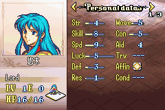

# FE cn-Font Installer Py-Generator for FE8U

可以根据字模文件自动生成EA烧录文本的Python工具

## 使用方式：

- 1. 将rom文件（假设此处为`FE8U.gba`）与MakeGlyphInstaller.py放置在同一个目录下（以识别字模列表数据）
	
- 2. 将字模图片文件放入目录`\FontData`内。字模文件可以参考[FE_Font_tiles_generator](https://github.com/mitltl/FE_Font_tiles_generator.git) 进行生成，也可直接使用已有的字库。按照道具字体更改名称为`FontItem`+字+`.png`，对话字体更改名称为`FontText`+字+`.png`。python组件可以自动识别字模长度所以不需要在做其他设定。
	
- 3. 返回主目录，使用指令：`python MakeGlyphInstaller.py FE8U.gba`，即可生成EA烧录字库文本`FE8U-CN-Font-Installer.event`，使用EA烧录即可。

也可以前往[这里](https://github.com/MokhaLeee/FE8U-cnFont-EAInstaller.git) 下载已经烧录好的EA文本

## 
这一方式只需要识别字模的文件名称，而不需要再做fontall.txt文档。同时由于引入Py组件并对算法做了优化，整体程序运行速度，以及可扩展性都比以往依靠Png2Dmp的方法高效不少。

生成的EA文本已集成有`Anti-Huffman`与`Draw-UTF8`补丁，烧录完成后可直接识别中文字符：

此处作为示例，仅烧录"悠"、"木"两个字符，并将Eirika的角色名称替换为"悠木"作为测试。你可以自行替换FontData文件夹内的所有字模。

